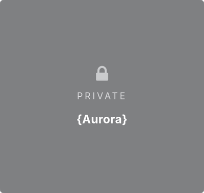
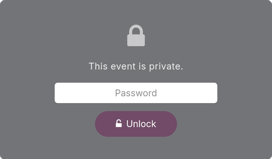
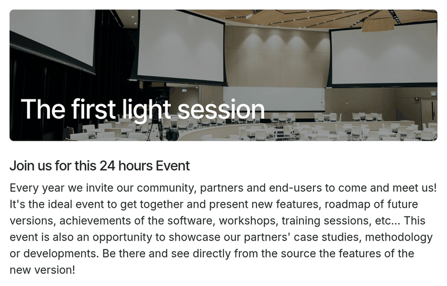

On the website:

- The events listing shows private events redacted: no name, date, location
  or image, only a lock, "Private" and the codename, if one is set.

  

- Opening a private event displays an info-free password wall instead of the
  event page.

  

- Once a visitor enters the correct password, the event page and its
  sub-pages are shown for the rest of the browsing session.

  

- Event managers (group *Event / User*) skip the wall, so they can preview
  and edit private events as usual.
